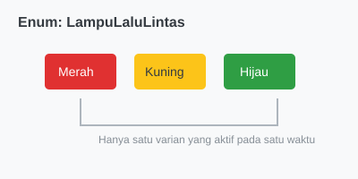

# CH-01_Basic_Enums

> **"Memilih Satu dari Banyak."**

Dunia ini penuh dengan pilihan yang terbatas. Sebuah arah mata angin hanya bisa Utara, Selatan, Timur, atau Barat. Sebuah lampu lalu lintas hanya bisa Merah, Kuning, atau Hijau. Dalam pemrograman, kita merepresentasikan pilihan-pilihan pasti ini menggunakan **Enums**.

---

## 🔍 Apa itu "Enum"?

**Enum** (Enumeration) adalah tipe data yang memungkinkan Anda mendefinisikan sebuah tipe dengan menyebutkan seluruh varian (pilihan) yang mungkin. Variabel bertipe Enum hanya bisa memegang satu varian pada satu waktu.

---

## 🎭 Analogi: "Menu Dropdown"

### 1. Analogi Singkat (The Quick Snap)
Enum seperti **Menu Dropdown** di sebuah formulir web. Anda klik, dan Anda melihat daftar pilihan (misal: Jenis Kelamin, Provinsi, atau Metode Pembayaran). Anda **harus** memilih salah satu dari daftar tersebut; Anda tidak bisa mengetik sesuatu yang tidak ada di daftar.

### 2. Analogi Panjang (The Deep Dive)
Bayangkan Anda sedang memesan kopi di sebuah **Kafe (Program)**.

1.  **Pilihan Rasa (Enum Definition)**: Kafe tersebut hanya menyediakan tiga rasa: `Original`, `Latte`, dan `Cappuccino`. Ini adalah "Enum Rasa Kopi".
2.  **Pemesanan (Variable Declaration)**: Saat Anda memesan, pelayan mencatat pesanan Anda. Pesanan Anda **pasti** salah satu dari tiga itu. Tidak mungkin Anda memesan "Jus Jeruk" jika itu tidak ada dalam Enum tersebut.
3.  **Kepastian (Type Safety)**: Karena pelayan (Compiler) sudah tahu daftar rasanya, dia tidak akan pernah bingung. Jika Anda mencoba memesan rasa yang tidak ada, dia akan langsung memprotes sebelum kopi mulai dibuat.

---

## 💻 Contoh Kode: Definisi Sederhana

```rust
enum IpAddrKind {
    V4,
    V6,
}

fn main() {
    let four = IpAddrKind::V4;
    let six = IpAddrKind::V6;

    route(four);
    route(six);
}

fn route(ip_kind: IpAddrKind) {
    // Memproses arah IP...
}
```

---

## 🗺️ Visualisasi: Struktur Enum Sederhana



---
> [!TIP]
> **Kapan Menggunakan Enum?** Gunakan Enum saat Anda memiliki sekumpulan nilai yang saling eksklusif (tidak bisa terjadi bersamaan) dan terbatas jumlahnya.

---
*Kembali ke [Buku](../README.md)*
