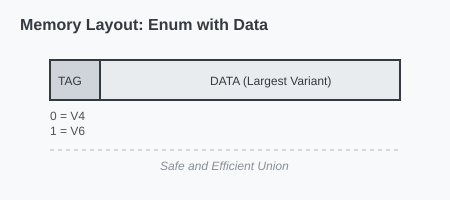

# CH-02_Enums_With_Data

> **"Satu Wadah, Berbagai Muatan."**

Salah satu kekuatan terbesar Enum di Rust (yang jarang ada di bahasa lain) adalah kemampuannya untuk menyimpan data langsung di dalam variannya. Enum di Rust bukan sekadar daftar konstanta, melainkan struktur data yang cerdas.

---

## 🔍 Apa itu "Enums with Data"?

Dalam Rust, setiap varian dari sebuah Enum bisa memiliki tipe data yang berbeda-beda. Anda bisa memiliki varian yang tidak punya data sama sekali, varian dengan nama field (seperti struct), atau varian dengan tuple data.

---

## 🎭 Analogi: "Paket Kurir"

### 1. Analogi Singkat (The Quick Snap)
Enum dengan data seperti **Layanan Kurir**. Tipenya cuma satu: *"Pengiriman"*. Namun, isi paketnya bisa berbeda-beda. Ada yang berisi `Dokumen` (teks), ada yang berisi `Barang Pecah Belah` (berat & dimensi), dan ada yang berupa `Uang` (nilai nominal).

### 2. Analogi Panjang (The Deep Dive)
Bayangkan Anda mengelola **Pusat Logistik (Enum)**.

1.  **Satu Kategori (Enum Name)**: Semua yang masuk ke gudang Anda disebut `ItemLogistik`.
2.  **Bentuk yang Berbeda (Variants)**:
    *   Varian `Surat`: Hanya berisi teks alamat tujuan.
    *   Varian `Paket`: Berisi berat (integer) dan kategori barang (string).
    *   Varian `Kosong`: Hanya berisi info bahwa ini adalah retur kosong (tanpa data tambahan).
3.  **Kesatuan**: Walaupun isinya sangat berbeda, sistem Anda tetap menganggap semuanya sebagai `ItemLogistik`. Anda bisa memasukkan semuanya ke dalam satu truk (Array/Vector) yang sama.

---

## 💻 Contoh Kode: Pesan yang Fleksibel

```rust
enum Message {
    Quit,                       // Tidak ada data
    Move { x: i32, y: i32 },    // Data seperti struct
    Write(String),              // Data sebuah String
    ChangeColor(i32, i32, i32), // Data tuple (RGB)
}

fn main() {
    let m1 = Message::Write(String::from("halo"));
    let m2 = Message::Move { x: 10, y: 20 };
    let m3 = Message::Quit;

    // Ketiganya memiliki tipe yang sama: Message
}
```

---

## 🗺️ Visualisasi: Memori Enum dengan Data

Enum di memori akan berukuran sebesar varian terbesarnya, ditambah sedikit penanda (*Tag*) untuk mengetahui varian mana yang sedang aktif.



---
> [!IMPORTANT]
> **Keunggulan**: Dengan menyimpan data di Enum, Anda menghindari penggunaan `void pointer` atau `union` yang tidak aman seperti di bahasa C. Rust menjamin Anda tidak akan pernah salah membaca data dari varian yang tidak aktif.

---
*Kembali ke [Buku](../README.md)*
