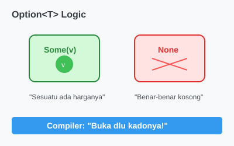

# CH-03_The_Option_Enum

> **"Kotak Kado: Ada Isinya atau Kosong Melompong."**

Konsep paling revolusioner (dan mungkin paling menantang bagi pemula) di Rust adalah: **Tidak ada `null`**. Rust mengganti konsep "ketiadaan data" dengan sebuah Enum spesial bernama **`Option<T>`**.

---

## 🔍 Apa itu "The Option Enum"?

Dalam banyak bahasa, variabel bisa bernilai `null` (kosong). Masalahnya, jika Anda lupa mengecek apakah variabel itu `null` sebelum menggunakannya, program Anda akan *crash* (**`NullPointerException`**).

Rust menggunakan Enum `Option<T>` dengan dua varian:
1.  **`Some(T)`**: Berarti ada datanya (bertipe `T`).
2.  **`None`**: Berarti datanya benar-benar tidak ada.

Karena ini adalah Enum, Anda **dipaksa** untuk mengecek isinya sebelum bisa menggunakan nilai di dalamnya. Compiler tidak akan membiarkan Anda "lupa".

---

## 🎭 Analogi: "Kotak Kado Misterius"

### 1. Analogi Singkat (The Quick Snap)
`Option` seperti sebuah **Kotak Kado**. Anda tidak tahu apakah di dalamnya ada `Sepeda` (data) atau cuma `Angin` (None). Untuk bisa menaiki sepedanya, Anda harus membuka kotaknya terlebih dahulu. Jika kotaknya kosong, Anda tidak bisa menaiki apa pun.

### 2. Analogi Panjang (The Deep Dive)
Bayangkan Anda sedang mengambil **Kunci Kamar (Data)** di meja resepsionis hotel otomatis.

1.  **Pencarian**: Anda memasukkan nomor kamar di mesin. Mesin memberikan Anda sebuah kotak.
2.  **Kondisi `Some`**: Anda membuka kotak, dan di dalamnya ada kunci. Anda bisa masuk ke kamar.
3.  **Kondisi `None`**: Anda membuka kotak, tapi isinya kosong. Mungkin kamarnya belum siap atau nomornya salah.
4.  **Keamanan**: Di hotel biasa (Bahasa Lain), resepsionis mungkin cuma memberikan Anda "bayangan kunci". Jika Anda nekat mencoba membuka pintu dengan bayangan itu, Anda akan menabrak pintu. Di Rust, Anda wajib melihat ke dalam kotak. Jika kosong, sistem keamanan hotel langsung memberikan prosedur alternatif (Error Handling).

---

## 💻 Contoh Kode: Menangani Nilai yang Mungkin Tidak Ada

```rust
fn main() {
    let ada_angka = Some(5);
    let tidak_ada_angka: Option<i32> = None;

    // Kita tidak bisa langsung menjumlahkan Option<i32> dengan i32 biasa.
    // let jumlah = ada_angka + 5; // ❌ ERROR!
    
    // Kita harus 'membuka' kado tersebut.
}
```

---

## 🗺️ Visualisasi: Option vs Null

Null seperti lubang jebakan di jalan yang tidak terlihat. `Option` seperti tanda peringatan di depan lubang tersebut.



---
> [!IMPORTANT]
> **Mantra Rust**: *"Jika Anda melihat tipe data yang bukan `Option`, Anda bisa 100% yakin bahwa datanya PASTI ada."* Keyakinan ini membuat kode Rust sangat stabil.

---
*Kembali ke [Buku](../README.md)*
