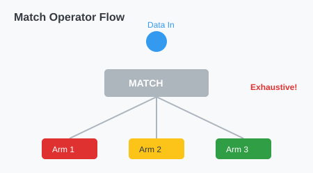

# CH-01_The_Match_Operator

> **"Mesin Sortir: Tak Ada Kasus yang Terlewat."**

Dalam pemrograman, kita sering butuh melakukan aksi berbeda tergantung pada nilai suatu variabel. Jika di bahasa lain Anda menggunakan `switch-case`, Rust memiliki **`match`**—sebuah operator yang jauh lebih aman dan ekspresif.

---

## 🔍 Apa itu "Match Operator"?

**`match`** adalah operator kendala aliran (*control flow*) yang memungkinkan Anda membandingkan suatu nilai dengan serangkaian pola (*patterns*) dan mengeksekusi kode berdasarkan pola yang cocok.

Kelebihan utama `match` di Rust adalah **Exhaustiveness** (Keharusan Menyeluruh). Compiler akan protes jika Anda lupa menangani salah satu varian Enum di dalam `match`.

---

## 🎭 Analogi: "Mesin Sortir Koin"

### 1. Analogi Singkat (The Quick Snap)
`match` seperti **Mesin Sortir Koin** otomatis. Anda memasukkan koin di bagian atas, dan mesin tersebut memiliki lubang-lubang dengan ukuran berbeda. Koin akan jatuh ke lubang yang pas ukurannya. Jika ukurannya tidak pas dengan lubang mana pun, mesin akan mengarahkannya ke lubang "Lain-lain".

### 2. Analogi Panjang (The Deep Dive)
Bayangkan Anda bekerja di **Gudang Logistik (Program)** sebagai penyortir barang.

1.  **Pemeriksaan (The Match Expression)**: Anda mengambil sebuah paket (Data Enum).
2.  **Daftar Aturan (Match Arms)**: Anda memiliki buku panduan:
    *   Jika paket berlabel `Pecah Belah`, taruh di rak empuk.
    *   Jika paket berlabel `Dokumen`, taruh di laci arsip.
    *   Jika paket berlabel `Cairan`, taruh di wadah kedap air.
3.  **Keamanan (Exhaustiveness)**: Jika ada paket baru bertanda `Elektronik` tapi tidak ada di buku panduan Anda, Anda dilarang bekerja oleh supervisor (Compiler) sampai Anda menambahkan aturan untuk paket tersebut. Tidak boleh ada paket yang tidak jelas nasibnya.

---

## 💻 Contoh Kode: Menghitung Nilai Koin

```rust
enum Coin {
    Penny,
    Nickel,
    Dime,
    Quarter,
}

fn value_in_cents(coin: Coin) -> u8 {
    match coin {
        Coin::Penny => {
            println!("Koin keberuntungan!");
            1
        },
        Coin::Nickel => 5,
        Coin::Dime => 10,
        Coin::Quarter => 25,
    }
}
```

---

## 🗺️ Visualisasi: Aliran Match



---
> [!IMPORTANT]
> **Placeholder `_`**: Jika Anda memiliki terlalu banyak kemungkinan (misal: angka 1-100) dan hanya peduli pada beberapa saja, Anda bisa menggunakan pola `_` sebagai "sapu jagat" untuk menangani sisa kasus lainnya.

---
*Kembali ke [Buku](../README.md)*
