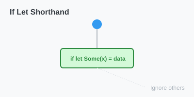

# CH-02_If_Let_Syntax

> **"Filter Cepat: Hanya untuk yang Penting."**

Menggunakan `match` sangat aman karena memaksa kita menangani semua kemungkinan. Namun, terkadang kita hanya peduli pada **satu** kemungkinan saja dan ingin mengabaikan sisanya. Menulis `match` dengan banyak `_ => ()` terasa sangat melelahkan. Rust memberikan solusinya: **`if let`**.

---

## 🔍 Apa itu "if let"?

**`if let`** adalah cara singkat untuk menulis `match` yang hanya menjalankan kode jika suatu nilai cocok dengan satu pola tertentu. Ini membuat kode Anda lebih ringkas dan mudah dibaca (meskipun Anda mengorbankan pemeriksaan menyeluruh dari compiler).

---

## 🎭 Analogi: "Alat Filter Kopi"

### 1. Analogi Singkat (The Quick Snap)
`if let` seperti **Filter Kopi**. Anda menuangkan ketel (Data Option/Enum), dan Anda hanya ingin mengambil **Kopi**nya saja (Varian `Some`). Ampasnya (Varian `None`) tidak Anda urus—biarkan saja di filter.

### 2. Analogi Panjang (The Deep Dive)
Bayangkan Anda adalah seorang **Satpam VIP (Program)**.

1.  **Skenario `match`**: Anda harus mengecek setiap orang yang lewat. Jika dia Pejabat, beri hormat. Jika dia Staf, minta ID. Jika dia Tamu, minta buku tamu. Jika dia Orang Asing, usir. Anda harus punya prosedur untuk **semua orang**.
2.  **Skenario `if let`**: Anda hanya ditugaskan menyapa **Gubernur**. Jika yang lewat adalah Gubernur, Anda beri hormat. Siapa pun selain Gubernur (Staf, Tamu, Kucing), Anda **diam saja** dan tidak peduli. 

`if let` adalah mode "hanya peduli pada tamu spesial" tersebut.

---

## 💻 Contoh Kode: Perbandingan Match vs If Let

```rust
fn main() {
    let some_value = Some(3);

    // Menggunakan match (Verbose)
    match some_value {
        Some(3) => println!("Tiga!"),
        _ => (), // Kita dipaksa menulis ini agar compiler senang
    }

    // Menggunakan if let (Ringkas)
    if let Some(3) = some_value {
        println!("Tiga!");
    }
}
```

---

## 🗺️ Visualisasi: Shorthand Logic



---
> [!TIP]
> **Kapan Pakai `if let`?** Gunakan jika logika `match` Anda terlalu sederhana dan hanya memiliki satu cabang aksi. Jika logic-nya kompleks, tetaplah gunakan `match` demi keamanan.

---
*Kembali ke [Buku](../README.md)*
