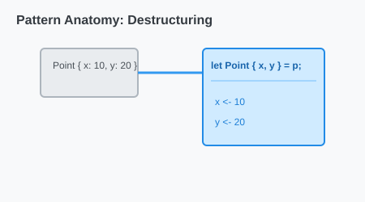

# CH-03_Pattern_Basics

> **"Sidik Jari Data: Mencocokkan Tekstur."**

Pola (*Patterns*) adalah jantung dari `match` dan `if let`. Mereka bukan sekadar perbandingan nilai (seperti `x == 5`), melainkan mekanisme untuk membongkar struktur data dan mengambil isinya.

---

## 🔍 Apa itu "Patterns"?

**Pattern** adalah sintaks khusus di Rust yang menggambarkan bentuk data. Kita menggunakan pola untuk:
1.  Mencocokkan nilai literal.
2.  Membongkar (Destructuring) struct atau enum.
3.  Mengambil nilai ke dalam variabel baru.

---

## 🎭 Analogi: "Detektif dan Jejak Kaki"

### 1. Analogi Singkat (The Quick Snap)
Pattern seperti **Cetakan Kue**. Anda memiliki adonan data. Anda menekan cetakan tersebut ke adonan. Jika adonannya pas dengan bentuk cetakan (Bintang, Bulan, atau Bulat), maka Anda berhasil mendapatkan "Kue" dengan bentuk tersebut.

### 2. Analogi Panjang (The Deep Dive)
Bayangkan Anda adalah seorang **Detektif (Compiler)** yang memeriksa TKP.

1.  **Pencarian Bukti (Match Expression)**: Ada sebuah barang bukti yang ditemukan (Variabel).
2.  **Penyocokan (Patterns)**:
    *   **Literal Pattern**: "Apakah ukuran sepatunya tepat 42?"
    *   **Range Pattern**: "Apakah tinggi badannya di antara 170 hingga 180 cm?"
    *   **Destructuring Pattern**: "Ada dompet di saku kirinya? Jika ada, ambil KTP-nya (Variabel baru) dari dalam dompet tersebut."
3.  **Hasil**: Jika semua kriteria dalam satu profil (Arm) cocok, detektif langsung tahu siapa pelakunya dan memulai prosedur penangkapan.

---

## 💻 Contoh Kode: Kekuatan Destructuring

```rust
fn main() {
    let point = (3, 5);

    match point {
        (0, 0) => println!("Di titik pusat"),
        (x, y) => println!("Berada di koordinat x: {}, y: {}", x, y),
    }

    // Pola Range (Jangkauan)
    let angka = 15;
    match angka {
        1..=10 => println!("Angka kecil"),
        11..=20 => println!("Angka menengah"),
        _ => println!("Angka besar"),
    }
}
```

---

## 🗺️ Visualisasi: Pattern Matching Logic

Mencocokkan bentuk, bukan hanya nilai.



---
> [!TIP]
> **Destructuring**: Kemampuan untuk mengambil data dari dalam struktur yang kompleks dalam satu baris kode adalah salah satu alasan mengapa kode Rust terasa sangat ringkas namun deskriptif.

---
*Kembali ke [Buku](../README.md)*
