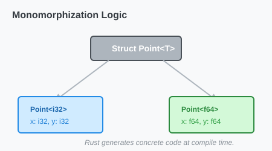

# CH-01_Type_Generics

> **"Wadah Fleksibel: Menampung Apa Saja."**

Terkadang kita ingin membuat sebuah struktur data (seperti `Point` atau `Option`) yang bisa menyimpan angka, teks, atau objek lainnya. Daripada membuat satu struct untuk setiap tipe, kita menggunakan **Generic Type Parameters**.

---

## 🔍 Apa itu "Type Generics"?

**Type Generics** memungkinkan kita mendefinisikan struct atau enum dengan menggunakan placeholder (biasanya huruf kapital seperti `T`, `U`, atau `V`) sebagai pengganti tipe data konkrit. Tipe aslinya baru akan ditentukan saat kita membuat *instance* dari struct tersebut.

---

## 🎭 Analogi: "Kotak Kontainer Pengiriman"

### 1. Analogi Singkat (The Quick Snap)
Type Generics seperti **Kotak Kontainer Standar**. Kontainernya memiliki bentuk dan ukuran yang sama (Struct), tetapi isinya bisa apa saja (Generic): Mobil, Pakaian, atau Barang Elektronik. Kontainer tidak peduli apa isinya, tugasnya hanya membungkus.

### 2. Analogi Panjang (The Deep Dive)
Bayangkan Anda adalah seorang **Pembuat Furnitur (Programmer)**.

1.  **Rak Buku (Struct)**: Anda ingin mendesain sebuah rak.
2.  **Generic Design (`Rak<T>`)**: Anda membuat desain rak yang fleksibel. Anda tidak menentukan apakah rak ini untuk `Buku`, `Trofi`, atau `Tanaman`. Anda hanya menentukan struktur papannya.
3.  **Implementasi Konkrit**:
    *   Pelanggan A ingin **Rak untuk Buku**: Anda membuat `Rak<Buku>`.
    *   Pelanggan B ingin **Rak untuk Sepatu**: Anda membuat `Rak<Sepatu>`.
4.  **Efisiensi**: Anda hanya butuh SATU desain cetak biru (Generic) untuk melayani berbagai kebutuhan pelanggan yang berbeda.

---

## 💻 Contoh Kode: Struct Koordinat

```rust
struct Point<T> {
    x: T,
    y: T,
}

fn main() {
    let integer = Point { x: 5, y: 10 };    // Point<i32>
    let float = Point { x: 1.0, y: 4.0 };  // Point<f64>
    
    // let mixed = Point { x: 5, y: 4.0 }; // ❌ ERROR! T harus tipe yang sama.
}
```

---

## 🗺️ Visualisasi: Monomorphization

Di balik layar, Rust akan membuat salinan kode untuk setiap tipe konkrit yang Anda gunakan. Hal ini membuat Generics di Rust sangat cepat (Zero-cost abstraction).



---
> [!TIP]
> **Placeholder `T`**: Gunakan `T` sebagai standar untuk "Type". Jika Anda butuh dua tipe yang berbeda, gunakan `T` dan `U`.

---
*Kembali ke [Buku](../README.md)*
