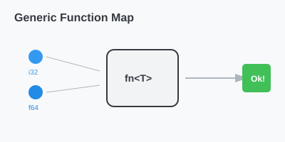

# CH-02_Function_Generics

> **"Satu Logika, Banyak Wujud."**

Sama seperti struct, fungsi di Rust juga bisa dibuat sangat fleksibel menggunakan Generics. Ini memungkinkan kita menulis algoritma (misal: pengurutan, pencarian) satu kali saja, namun bisa digunakan untuk tipe data apa pun.

---

## 🔍 Apa itu "Function Generics"?

**Function Generics** adalah teknik mendefinisikan parameter fungsi menggunakan placeholder tipe. Anda menaruh tipe generic di dalam kurung siku `<T>` tepat setelah nama fungsi.

---

## 🎭 Analogi: "Mesin Cetak Kue"

### 1. Analogi Singkat (The Quick Snap)
Function Generics seperti **Mesin Cetak Kue**. Logikanya sama: *Tekan, Bentuk, Lalu Keluarkan*. Anda bisa memasukkan adonan `Cokelat`, `Vanila`, atau `Stroberi`. Hasilnya berbeda-beda, tapi cara kerjanya identik.

### 2. Analogi Panjang (The Deep Dive)
Bayangkan Anda memiliki sebuah **Mesin Pengemas (Fungsi)**.

1.  **Daftar Tugas (Logika Fungsi)**: Tugas mesin adalah mengambil satu barang, membungkusnya dengan plastik, dan menaruhnya di boks.
2.  **Generic Machine (`Kemas<T>`)**: Mesin ini tidak peduli apakah yang masuk itu `Buku`, `Kaos`, atau `Mainan`.
3.  **Proses Kerja**: 
    - Anda memasukkan `Buku`, mesin mengeluarkan `Boks<Buku>`.
    - Anda memasukkan `Kaos`, mesin mengeluarkan `Boks<Kaos>`.
4.  **Keunggulan**: Anda tidak perlu membangun 10 mesin berbeda untuk 10 jenis barang. Cukup satu mesin pengemas generic yang bisa diatur untuk berbagai jenis barang.

---

## 💻 Contoh Kode: Fungsi Terbesar

```rust
// Mencari nilai terbesar (Tipe Generic)
// Kita harus menambahkan 'PartialOrd' (Akan dibahas di bab Traits)
fn terbesar<T: PartialOrd>(list: &[T]) -> &T {
    let mut largest = &list[0];

    for item in list {
        if item > largest {
            largest = item;
        }
    }

    largest
}

fn main() {
    let list_angka = vec![34, 50, 25, 100, 65];
    println!("Terbesar: {}", terbesar(&list_angka));

    let list_char = vec!['y', 'm', 'a', 'q'];
    println!("Terbesar: {}", terbesar(&list_char));
}
```

---

## 🗺️ Visualisasi: Generic Execution



---
> [!IMPORTANT]
> **Zero Cost**: Meskipun kodenya terlihat fleksibel, Rust compiler akan melakukan optimasi sehingga performanya tetap secepat jika Anda menulis fungsi khusus untuk satu tipe data.

---
*Kembali ke [Buku](../README.md)*
