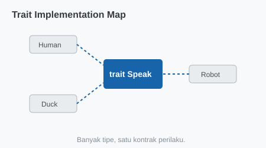

# CH-01_Defining_Traits

> **"Sertifikat Kemampuan: Apa yang Bisa Dilakukan?"**

Dalam Rust, kita tidak bertanya *"Siapa tipe data ini?" (Inheritance)*, melainkan kita bertanya *"Apa yang bisa dilakukan tipe data ini?" (Traits)*. Di bab ini, kita akan belajar cara mendefinisikan "Kontrak Perilaku" yang bisa disepakati oleh berbagai tipe data.

---

## 🔍 Apa itu "Defining Traits"?

**Trait** adalah sekumpulan metode yang didefinisikan untuk suatu tujuan tertentu. Jika sebuah tipe data mengimplementasikan sebuah Trait, itu artinya tipe tersebut berjanji untuk memiliki metode-metode yang ada di dalam Trait tersebut.

---

## 🎭 Analogi: "Lisensi Beroperasi"

### 1. Analogi Singkat (The Quick Snap)
Trait seperti **Izin Mengemudi**. Tidak peduli apakah Anda seorang `Dokter`, `Guru`, atau `Chef` (Type), jika Anda memiliki SIM (Trait Pengemudi), maka Anda bisa melakukan aksi `Menyetir`. 

### 2. Analogi Panjang (The Deep Dive)
Bayangkan Anda sedang membangun sebuah **Kota Pintar (Program)**.

1.  **Definisi Kemampuan (Trait)**: Anda mendefinisikan sebuah kemampuan bernama `BisaBersuara`. Kontraknya sederhana: siapa pun yang memiliki kemampuan ini harus bisa melakukan aksi `keluarkan_suara()`.
2.  **Penerapan Ke Berbagai Objek (Implementation)**:
    *   **Mobil**: Mengimplementasikan `BisaBersuara` dengan bunyi *"Brum-Brum"*.
    *   **Manusia**: Mengimplementasikan `BisaBersuara` dengan bunyi *"Halo"*.
    *   **Robot**: Mengimplementasikan `BisaBersuara` dengan bunyi *"Beep-Boop"*.
3.  **Kesamaan**: Di mata sistem manajemen suara kota, mereka semua adalah "Objek yang Bisa Bersuara". Sistem tidak perlu tahu apakah itu mobil atau robot, yang penting mereka punya metode `keluarkan_suara()`.

---

## 💻 Contoh Kode: Trait Ringkasan

```rust
pub trait Summary {
    fn summarize(&self) -> String;
}

pub struct NewsArticle {
    pub headline: String,
    pub content: String,
}

impl Summary for NewsArticle {
    fn summarize(&self) -> String {
        format!("{}: {}", self.headline, self.content)
    }
}

pub struct Tweet {
    pub username: String,
    pub content: String,
}

impl Summary for Tweet {
    fn summarize(&self) -> String {
        format!("{}: {}", self.username, self.content)
    }
}
```

---

## 🗺️ Visualisasi: Trait Implementation Map



---
> [!IMPORTANT]
> **Orphan Rule**: Anda hanya bisa mengimplementasikan Trait pada sebuah tipe jika salah satu dari mereka (Trait atau Tipe tersebut) didefinisikan secara lokal di dalam *crate* (proyek) Anda. Anda tidak bisa mengimplementasikan Trait eksternal pada Tipe data eksternal lainnya.

---
*Kembali ke [Buku](../README.md)*
