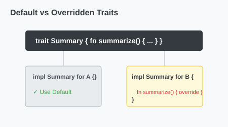

# CH-02_Default_Implementations

> **"Modul Standar: Kemudahan Tanpa Pengulangan."**

Terkadang, sebagian besar tipe data akan melakukan hal yang sama saat menjalankan metode sebuah Trait. Daripada menulis ulang logika tersebut di setiap `impl`, Rust mengizinkan kita memberikan **Default Implementation** (Implementasi Bawaan).

---

## 🔍 Apa itu "Default Implementations"?

Saat mendefinisikan Trait, Anda bisa langsung menulis isi (body) dari metodenya. Tipe data yang mengimplementasikan Trait tersebut sekarang memiliki dua pilihan:
1.  **Menggunakan Default**: Tidak menulis ulang metode tersebut (otomatis menggunakan yang ada di Trait).
2.  **Overriding**: Menulis ulang metode tersebut jika butuh perilaku yang spesifik.

---

## 🎭 Analogi: "Fitur Standar Kendaraan"

### 1. Analogi Singkat (The Quick Snap)
Default Implementation seperti **Sistem Hiburan Bawaan** di mobil. Pabrik memberikan sistem audio standar. Jika pembeli merasa cukup, dia pakai yang standar. Jika pembeli ingin yang lebih canggih, dia bisa menggantinya (*Override*) dengan sistem audio pilihannya sendiri.

### 2. Analogi Panjang (The Deep Dive)
Bayangkan Anda membuat template untuk **Karyawan Perusahaan (Trait)**.

1.  **Metode Kerja**: Setiap karyawan punya metode `bekerja()`. Karena setiap posisi berbeda, ini harus didefinisikan sendiri (Tanpa default).
2.  **Metode Makan Siang (Default)**: Perusahaan punya aturan standar untuk makan siang: *"Pergi ke kantin jam 12:00"*. 
3.  **Implementasi**:
    *   **Karyawan Kantor**: Pakai aturan standar (Default). Tidak perlu diajarkan lagi cara makan siang.
    *   **Satpam**: Harus *Override*. Karena dia harus berjaga, aturan makan siangnya dirubah menjadi: *"Makan di pos jaga secara bergantian"*.
4.  **Efisiensi**: Anda tidak perlu menjelaskan cara makan siang kepada 90% karyawan yang perilakunya sama dengan standar perusahaan.

---

## 💻 Contoh Kode: Menggunakan Default

```rust
pub trait Summary {
    // Default implementation
    fn summarize(&self) -> String {
        String::from("(Baca selengkapnya...)")
    }
}

pub struct NewsArticle {
    pub headline: String,
}

// Menggunakan default (kosongkan body impl)
impl Summary for NewsArticle {}

fn main() {
    let article = NewsArticle {
        headline: String::from("Rust Rilis Fitur Baru!"),
    };

    println!("{}", article.summarize()); // Output: (Baca selengkapnya...)
}
```

---

## 🗺️ Visualisasi: Default vs Overridden



---
> [!TIP]
> **Kombinasi**: Metode default sering kali memanggil metode lain di dalam Trait yang sama yang TIDAK memiliki default. Ini memungkinkan Anda membangun logika kompleks yang hanya membutuhkan sedikit input spesifik dari tipe datanya.

---
*Kembali ke [Buku](../README.md)*
