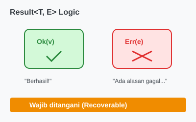

# CH-01_The_Result_Enum

> **"Peti Harta Karun: Hadiah atau Jebakan."**

Di Rust, banyak operasi yang bisa gagal (seperti membuka file atau membaca input user) tidak langsung mengembalikan data, melainkan mengembalikan sebuah "Peti" bertipe **`Result<T, E>`**. Anda harus membuka peti tersebut untuk mengetahui apakah operasinya berhasil atau gagal.

---

## 🔍 Apa itu "The Result Enum"?

**`Result<T, E>`** adalah Enum dengan dua varian:
1.  **`Ok(T)`**: Operasi berhasil, dan data `T` ada di dalamnya.
2.  **`Err(E)`**: Operasi gagal, dan informasi error `E` ada di dalamnya.

Ini mirip dengan `Option<T>`, tetapi alih-alih hanya "Ada" atau "Tidak Ada", `Result` memberikan alasan **mengapa** data tersebut tidak ada.

---

## 🎭 Analogi: "Peti Harta Karun Bertanda"

### 1. Analogi Singkat (The Quick Snap)
`Result` seperti **Peti Harta Karun**. Saat Anda membelinya, Anda tidak tahu apa isinya. 
- Jika Anda beruntung, Anda mendapatkan `Emas` (`Ok`). 
- Jika Anda sial, Anda mendapatkan `Surat Tagihan` (`Err`) yang menjelaskan mengapa harta karunnya tidak ada. 
Anda harus berurusan dengan "Surat Tagihan" tersebut sebelum bisa melanjutkan petualangan.

### 2. Analogi Panjang (The Deep Dive)
Bayangkan Anda adalah seorang **Koki (Program)** yang sedang memasak hidangan spesial.

1.  **Operasi (The Task)**: Anda meminta asisten (Fungsi) untuk mengambil **Bahan Rahasia (Data)** di gudang.
2.  **Hasil (`Result`)**: Asisten kembali membawa sebuah kotak tertutup.
    *   **Kondisi `Ok`**: Kotak dibuka, isinya adalah `Garam`. Anda lanjut memasak.
    *   **Kondisi `Err`**: Kotak dibuka, isinya adalah catatan: *"Gudang terbakar"* atau *"Garam habis"*. 
3.  **Respons**: Karena Anda menerima catatan error, Anda bisa memutuskan: *"Pakai gula saja"* atau *"Tutup restoran hari ini"*. Anda tidak akan pernah mencoba "memasak catatan" karena Rust memaksa Anda membaca isinya dulu.

---

## 💻 Contoh Kode: Membuka File

```rust
use std::fs::File;

fn main() {
    let greeting_file_result = File::open("hello.txt");

    let _greeting_file = match greeting_file_result {
        Ok(file) => file,
        Err(error) => panic!("Gagal membuka file: {:?}", error),
    };
}
```

---

## 🗺️ Visualisasi: Result Anatomy



---
> [!TIP]
> **Metode `unwrap`**: Jika Anda 100% yakin operasi akan berhasil dan tidak ingin repot menggunakan `match`, Anda bisa memanggil `.unwrap()`. Namun hati-hati, jika ternyata hasilnya adalah `Err`, program Anda akan langsung *crash*!

---
*Kembali ke [Buku](../README.md)*
