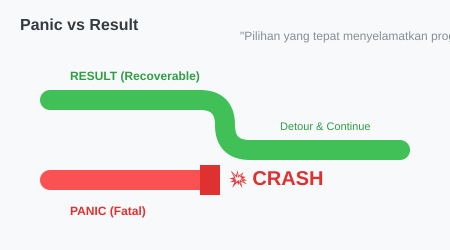

# CH-02_Panic_Vs_Errors

> **"Rem Tangan vs Setir: Mana yang Harus Dipilih?"**

Tidak semua kesalahan diciptakan sama. Kadang ada kesalahan yang bisa kita perbaiki (misal: salah ketik password), tapi ada juga kesalahan yang fatal (misal: mencoba mengakses memori yang tidak ada). Rust membedakan keduanya secara tegas.

---

## 🔍 Apa bedanya "Panic" dan "Error"?

1.  **Recoverable Errors (Dapat Dipulihkan)**: Kesalahan yang wajar terjadi dan program bisa melanjutkannya. Rust menggunakan **`Result<T, E>`**. Contoh: File tidak ditemukan, koneksi internet putus.
2.  **Unrecoverable Errors (Tidak Dapat Dipulihkan)**: Kesalahan fatal yang menandakan adanya bug di logika program. Rust menggunakan macro **`panic!`**. Contoh: Mengakses indeks array di luar batas (*out of bounds*).

---

## 🎭 Analogi: "Situasi saat Mengemudi"

### 1. Analogi Singkat (The Quick Snap)
- **`Result`** adalah **Setir**. Anda salah belokan, tapi Anda bisa memutar setir untuk kembali ke jalur yang benar.
- **`panic!`** adalah **Rem Tangan Mendadak**. Mesin mobil meledak, tidak ada gunanya lagi menyetir. Satu-satunya pilihan adalah berhenti total sebelum terjadi kecelakaan lebih parah.

### 2. Analogi Panjang (The Deep Dive)
Bayangkan Anda adalah seorang **Pilot (Program)**.

1.  **Recoverable (`Result`)**: Lampu indikator bensin menyala. Ini adalah "kesalahan", tapi pesawat tidak langsung jatuh. Anda melihat manual, memutuskan untuk pindah ke tangki cadangan, dan lanjut terbang. Anda menangani `Err(BensinHabis)` dengan aksi yang tepat.
2.  **Unrecoverable (`panic!`)**: Tiba-tiba kedua sayap pesawat lepas. Ini bukan lagi sesuatu yang bisa "ditangani" dengan prosedur standar. Program (Pesawat) akan langsung melakukan pembersihan darurat (*Unwinding*) dan berhenti demi keamanan penumpang (Sistem Operasi).

---

## 💻 Contoh Kode: Kapan Harus Panic?

```rust
fn main() {
    // 1. Contoh Unrecoverable (Panic otomatis oleh Rust)
    let v = vec![1, 2, 3];
    // v[99]; // ❌ PANIC! Program berhenti di sini.

    // 2. Contoh Manual Panic
    // panic!("Sesuatu yang sangat buruk terjadi!");

    // 3. Contoh Recoverable (Menggunakan Result)
    let angka: Result<i32, _> = "32".parse();
    // Jika parse gagal, program tidak crash, kita bisa menanganinya.
}
```

---

## 🗺️ Visualisasi: Jalur Keputusan



---
> [!CAUTION]
> **Gunakan `panic!` Sedikit Mungkin**: Dalam kode library atau aplikasi profesional, hampir selalu lebih baik mengembalikan `Result` dan membiarkan pemanggil fungsi yang memutuskan apakah mereka ingin panic atau tidak.

---
*Kembali ke [Buku](../README.md)*
