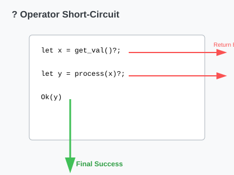

# CH-01_The_Question_Operator

> **"Tanya Jawab Kilat: Lanjut atau Lempar!"**

Menangani error dengan `match` di setiap baris kode bisa membuat fungsi Anda terlihat sangat panjang dan membingungkan (biasa disebut *callback hell* atau *nested insanity*). Rust menyediakan operator `?` sebagai "jalan tol" untuk menangani dan meneruskan error.

---

## 🔍 Apa itu "The Question Operator"?

Operator **`?`** yang diletakkan setelah pemanggilan fungsi yang mengembalikan `Result` (atau `Option`) memiliki logika sederhana:
1.  Jika hasilnya adalah **`Ok`**, ambil nilai di dalamnya dan lanjutkan eksekusi.
2.  Jika hasilnya adalah **`Err`**, kembalikan (`return`) error tersebut ke fungsi yang memanggil.

PENTING: Operator ini hanya bisa digunakan di dalam fungsi yang tipe pengembaliannya (*return type*) kompatibel dengan nilai yang di-`?`-kan.

---

## 🎭 Analogi: "Estafet Dokumen Kantor"

### 1. Analogi Singkat (The Quick Snap)
Operator `?` seperti **Sekretaris Jenius**. Jika dokumen yang Anda minta ada, dia langsung menaruhnya di meja Anda (`Ok`). Jika dokumennya tidak ada (Error), dia tidak akan mengganggu Anda dengan pertanyaan; dia langsung mengirim memo ke atasan Anda (`Err`) bahwa tugas tidak bisa dilanjutkan.

### 2. Analogi Panjang (The Deep Dive)
Bayangkan Anda adalah seorang **Manajer Menengah (Fungsi)** dalam sebuah birokrasi yang rumit.

1.  **Tugas**: Anda ditugaskan membuat laporan bulanan. Anda butuh data dari Departemen Keuangan dan Departemen SDM.
2.  **Proses Manual (`match`)**: Anda menelepon Keuangan. Jika mereka sibuk, Anda harus membuat keputusan sendiri. Lalu menelepon SDM. Jika mereka libur, Anda harus lapor ke bos. Melelahkan.
3.  **Proses `?`**: Anda hanya memberikan perintah: *"Ambilkan data Keuangan!"* 
    - Jika data didapat, Anda pakai.
    - Jika data TIDAK didapat, Anda otomatis "angkat tangan" dan memberitahu bos: *"Saya tidak bisa buat laporan karena data Keuangan tidak ada"*.
4.  **Efisiensi**: Laporan Anda hanya berisi langkah-langkah sukses. Langkah kegagalan sudah diurus otomatis oleh protokol `?`.

---

## 💻 Contoh Kode: Membaca Username dari File

```rust
use std::fs::File;
use std::io::{self, Read};

fn read_username_from_file() -> Result<String, io::Error> {
    let mut f = File::open("hello.txt")?; // Jika error, langsung return Err
    let mut s = String::new();
    f.read_to_string(&mut s)?;           // Jika error, langsung return Err
    Ok(s)                                // Jika sukses, bungkus dengan Ok
}

fn main() {
    let username = read_username_from_file();
    // Tangani hasil akhir di level main
}
```

---

## 🗺️ Visualisasi: Jalur Cepat (Short-Circuit)

Satu simbol, menghemat puluhan baris kode.



---
> [!TIP]
> **Chaining**: Anda bisa menyambungkan pemanggilan fungsi, misalnya: `File::open("hello.txt")?.read_to_string(&mut s)?;`. Sangat elegan!

---
*Kembali ke [Buku](../README.md)*
