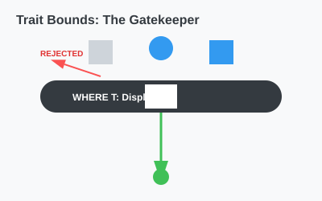

# CH-01_Basic_Bounds

> **"Syarat Pendaftaran: Hanya yang Memenuhi Kualifikasi."**

Generics memungkinkan kita menerima tipe apa pun, tapi terkadang kita butuh melakukan sesuatu pada tipe tersebut (seperti mencetaknya atau membandingkannya). Jika kita tidak memberi tahu Rust kemampuannya, compiler akan menolak. **Trait Bounds** adalah solusinya.

---

## 🔍 Apa itu "Trait Bounds"?

**Trait Bound** adalah cara kita membatasi parameter generic agar hanya menerima tipe yang mengimplementasikan satu atau lebih Trait tertentu. Sintaksnya menggunakan tanda titik dua setelah nama generic: `T: NamaTrait`.

---

## 🎭 Analogi: "Lowongan Pekerjaan"

### 1. Analogi Singkat (The Quick Snap)
Trait Bound seperti **Syarat Pendaftaran Lowongan**. Lowongan dibuka untuk umum (Generic), tapi ada syarat: *"Harus bisa Bahasa Inggris"* (Trait). Siapa pun (Person T) boleh mendaftar, asal dia membawa sertifikat TOEFL (Implementation).

### 2. Analogi Panjang (The Deep Dive)
Bayangkan Anda adalah seorang **Promotor Konser (Program)**.

1.  **Panggung (Fungsi Generic)**: Anda memiliki panggung yang bisa menampung siapa saja (`T`).
2.  **Masalah**: Jika Anda hanya mengizinkan "Siapa Saja", Anda tidak bisa menjamin konser akan berjalan. Bagaimana jika yang datang adalah `Batu`? Batu tidak bisa menyanyi.
3.  **Solusi (Bounds)**: Anda membuat aturan: *"Siapa saja (`T`) boleh naik panggung, ASALKAN dia adalah seorang `Penyanyi` (Trait)."*
4.  **Eksekusi**:
    *   `Budi` mendaftar. Karena Budi punya bakat `Penyanyi`, dia boleh naik.
    *   `Mobil` mendaftar. Karena Mobil bukan `Penyanyi`, dia ditolak oleh satpam (Compiler).
    *   Di atas panggung, Anda bisa dengan tenang memerintah: *"Nyanyi!"* (`t.bernyanyi()`) karena Anda yakin siapa pun di sana pasti bisa menyanyi.

---

## 💻 Contoh Kode: Membatasi Cetakan

```rust
use std::fmt::Display;

// T harus mengimplementasikan Display agar bisa dicetak dengan {}
fn cetak_dengan_bingkai<T: Display>(item: T) {
    println!("--- {} ---", item);
}

fn main() {
    cetak_dengan_bingkai(100);       // ✅ i32 punya Display
    cetak_dengan_bingkai("Halo");    // ✅ str punya Display
    
    // struct Kosong;
    // cetak_dengan_bingkai(Kosong); // ❌ ERROR! Kosong tidak punya Display
}
```

---

## 🗺️ Visualisasi: The Filtering Process



---
> [!TIP]
> **Sintaks `where`**: Jika Anda memiliki banyak generic dan banyak batasan (misal: `T: Display + Clone + PartialOrd`), kode Anda akan sulit dibaca. Gunakan klausa `where` untuk merapikannya di bagian bawah fungsi.

---
*Kembali ke [Buku](../README.md)*
