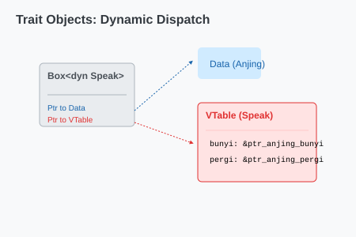

# CH-01_Dyn_Traits

> **"Karyawan Outsource: Yang Penting Hasilnya."**

Sampai sekarang, kita menggunakan Generics yang bersifat *Static Dispatch* (Compiler tahu persis tipe apa yang digunakan saat kompilasi). Tapi bagaimana jika kita ingin sebuah Vector yang berisi `Anjing`, `Kucing`, dan `Burung` sekaligus? Rust menggunakan **Trait Objects** (`&dyn Trait`) untuk ini.

---

## 🔍 Apa itu "Trait Objects"?

**Trait Object** adalah fitur yang memungkinkan Anda mengabstraksi tipe data konkrit dan hanya berfokus pada kemampuannya (Trait). Karena ukuran tipe konkritnya bermacam-macam, Trait Object harus selalu ditaruh di balik pointer (seperti `&dyn Trait` atau `Box<dyn Trait>`).

---

## 🎭 Analogi: "Karyawan Outsource"

### 1. Analogi Singkat (The Quick Snap)
Trait Object seperti menyewa **Karyawan Outsource**. Anda tidak peduli latar belakang pendidikannya atau hobi pribadinya (Type). Anda hanya peduli dia punya keahlian `Programmer` (Trait). Anda bisa memiliki tim yang isinya berbagai macam orang, asalkan semuanya bisa `MenulisKode`.

### 2. Analogi Panjang (The Deep Dive)
Bayangkan Anda mengelola sebuah **Rumah Sakit (Program)**.

1.  **Daftar Peralatan (Trait)**: Perusahaan butuh berbagai alat yang `BISA_STERIL`.
2.  **Koleksi Campuran**: Di gudang, Anda punya `Gunting`, `Meja Operasi`, dan `Jarum`. Ketiganya adalah benda yang sangat berbeda ukuran dan bentuknya.
3.  **Trait Object (`dyn Steril`)**: Saat tim pembersih datang, Anda cukup berkata: *"Ini ada tumpukan benda [Vector]. Saya tidak peduli benda apa itu, yang penting semuanya `Steril`. Bersihkan semuanya!"*
4.  **Runtime Decision**: Robot pembersih akan mendatangi benda pertama (`Gunting`), melihat labelnya, lalu membersihkannya. Lalu mendatangi benda kedua (`Meja`), dan seterusnya. Inilah yang disebut **Dynamic Dispatch**—keputusan cara membersihkan baru diambil saat robot menyentuh bendanya.

---

## 💻 Contoh Kode: Koleksi Berbagai Tipe

```rust
pub trait Draw {
    fn draw(&self);
}

pub struct Screen {
    pub components: Vec<Box<dyn Draw>>,
}

impl Screen {
    pub fn run(&self) {
        for component in self.components.iter() {
            component.draw();
        }
    }
}

struct Button { width: u32, height: u32 }
impl Draw for Button { fn draw(&self) { println!("Gambar Button"); } }

struct SelectBox { options: Vec<String> }
impl Draw for SelectBox { fn draw(&self) { println!("Gambar SelectBox"); } }

fn main() {
    let screen = Screen {
        components: vec![
            Box::new(Button { width: 50, height: 10 }),
            Box::new(SelectBox { options: vec![String::from("Ya"), String::from("Tidak")] }),
        ],
    };

    screen.run();
}
```

---

## 🗺️ Visualisasi: VTable (Virtual Table)

Di balik layar, Rust menyimpan pointer ke data asli dan pointer ke sebuah tabel metode (*VTable*).



---
> [!IMPORTANT]
> **Static vs Dynamic**: 
> - **Generics** lebih cepat dan memungkinkan optimasi lebih baik (Inlining). 
> - **Trait Objects** lebih fleksibel jika Anda tidak tahu tipe apa yang akan muncul saat runtime.

---
*Kembali ke [Buku](../README.md)*
