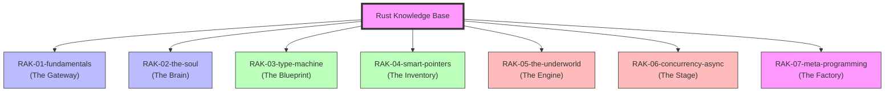

# Rust Knowledge Base

> **"Membangun Pemahaman dari Nol, Karena Dokumentasi Resmi Terlalu Kompleks."**

## Latar Belakang & Visi
Proyek ini lahir dari rasa pusing saat membaca dokumentasi resmi di [doc.rust-lang.org](https://doc.rust-lang.org). Meskipun lengkap, strukturnya seringkali terasa seperti kamus yang kaku dan sulit dicerna bagi yang ingin belajar secara naratif.

**Rust Knowledge Base** adalah manifestasi dari perjalanan saya belajar Rust dari nol. Saya mendekomposisi "Buku Besar" menjadi unit-unit kecil yang manusiawi menggunakan analogi **Perpustakaan Digital**.

## Tujuan (Objectives)
1. **Portofolio**: Menunjukkan kedalaman teknis dan kemampuan saya dalam mendokumentasikan sistem yang kompleks.
2. **Catatan Belajar Personal**: Dokumentasi perjalanan dari nol hingga mahir dengan cara saya sendiri.
3. **Shareable Resource**: Menjadi referensi yang bisa saya bagikan ke teman-teman yang juga ingin belajar Rust tanpa rasa takut.
4. **Living Documentation**: Selalu diperbarui mengikuti perkembangan sumber asli agar tetap relevan.

## Struktur Perpustakaan (7-Rack Architecture)
Repositori ini menggunakan standar **PPM (Perpustakaan Pribadi Modular)** dengan hierarki:
**Rak -> Sub-Rak -> Buku -> Bab -> Section.**

---

## Roadmap & Status Pengembangan

| Rak | Deskripsi | Sumber Utama | Status |
| :--- | :--- | :--- | :--- |
| `RAK-01-fundamentals/` | Sintaks & Logika Dasar | The Book (1-3) | [/] In Progress |
| `RAK-02-the-soul/` | Ownership, Borrowing, Lifetimes | The Book (4), Reference | *Planned* |
| `RAK-03-type-machine/` | Traits, Generics, Pattern Matching | The Book (6, 10, 17) | *Planned* |
| `RAK-04-smart-pointers/` | Inventory Memori (Box, Arc, Pin) | The Book (15) | *Planned* |
| `RAK-05-the-underworld/` | Unsafe, Raw Pointers, FFI | Nomicon, Reference | *Planned* |
| `RAK-06-concurrency-async/` | Multi-threading & Async Logic | The Book (16), Async Book | *Planned* |
| `RAK-07-meta-programming/` | Macros & Tooling Internals | The Book (19), Cargo Book | *Planned* |

## Visi Aktif
Repository ini bertindak sebagai **"The Brain"** dalam *Master Plan: Polyglot Senior Architect*. Fokus materi murni pada **Core Language Rust**.

---
*Dokumentasi Lengkap & Roadmap: [catatan](file:///i:/Workspace/Workspace-Syahputrawork/catatan/01-Language-Hubs/Rust-Knowledge-Base.md)*
*Panduan Struktur & Standar: [docs/structure-guide.md](./docs/structure-guide.md)*