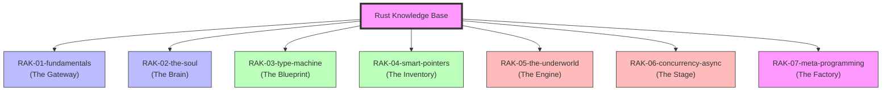

# Rust Knowledge Base

> **"Membangun Pemahaman dari Nol, Karena Dokumentasi Resmi Terlalu Kompleks."**

## Latar Belakang & Visi
Proyek ini lahir dari rasa pusing saat membaca dokumentasi resmi di [doc.rust-lang.org](https://doc.rust-lang.org). Meskipun lengkap, strukturnya seringkali terasa seperti kamus yang kaku dan sulit dicerna bagi yang ingin belajar secara naratif.

**Rust Knowledge Base** adalah manifestasi dari perjalanan saya belajar Rust dari nol. Saya mendekomposisi "Buku Besar" menjadi unit-unit kecil yang manusiawi menggunakan analogi **Perpustakaan Digital**.

## Tujuan (Objectives)
1. **Portofolio**: Menunjukkan kedalaman teknis dan kemampuan saya dalam mendokumentasikan sistem yang kompleks.
2. **Catatan Belajar Personal**: Dokumentasi perjalanan dari nol hingga mahir dengan cara saya sendiri.
3. **Shareable Resource**: Menjadi referensi yang bisa saya bagikan ke teman-teman yang juga ingin belajar Rust tanpa rasa takut.
4. **Living Documentation**: Selalu diperbarui mengikuti perkembangan sumber asli agar tetap relevan.

## Mengenal Rust: "Si Elang yang Tangguh" 🦅

Sebelum kita masuk ke teknis, kita perlu memahami **siapa** dan **apa** Rust itu sebenarnya. Rust adalah bahasa pemrograman sistem yang dirancang untuk tiga hal utama: **Keamanan (Safety)**, **Kecepatan (Performance)**, dan **Efisiensi (Productivity/Control)**.

### 🎭 Analogi: "Helm Full-Face & Motor Balap"
Bayangkan Anda sedang mengendarai motor balap (C++) di sirkuit. Motor itu sangat cepat, tapi jika Anda melakukan kesalahan kecil saja saat mengerem, akibatnya bisa fatal. Anda harus sangat berhati-hati.

**Rust** memberikan Anda motor yang sama cepatnya (bahkan terkadang lebih cepat), tetapi ia **mewajibkan** Anda memakai perlengkapan keamanan paling canggih: Helm Full-Face, Wearpack kevlar, dan sistem *traction control* yang pintar. 

Rust (sang *Compiler*) bertindak sebagai instruktur balap yang tidak akan membiarkan Anda menyalakan mesin jika helm Anda belum terpasang dengan benar. Dia "cerewet" di awal (saat menulis kode) agar Anda tidak pernah mengalami kecelakaan (bug memori) saat balapan sedang berlangsung (saat aplikasi berjalan).

### 🚀 Mengapa Menggunakan Rust?

1.  **Memory Safety Tanpa Garbage Collector (GC)**: Kebanyakan bahasa modern (Java, Python, JS) menggunakan GC untuk membersihkan memori, yang bisa menyebabkan "lag" tiba-tiba. Rust membersihkan memori secara otomatis melalui sistem **Ownership** yang jenius tanpa perlu GC.
2.  **Kecepatan Luar Biasa**: Karena tidak ada GC dan abstraksi yang bersifat "zero-cost", performa Rust setara dengan C/C++.
3.  **Mencegah Bug Segfault**: Di Rust, masalah klasik seperti *null pointer* atau mendata yang berpindah (*data race*) hampir mustahil terjadi karena dicegah sejak tahap penulisan kode.
4.  **Ekosistem Modern**: Dengan **Cargo**, manajer paket tercanggih di dunia pemrograman saat ini, mengelola proyek Rust terasa semudah menggunakan NPM atau Pip.

> [!TIP]
> **Ingin tahu lebih dalam?** Baca kisah lengkap penciptaan Rust, peran Graydon Hoare, dan filosofi di baliknya dalam dokumen: **[Asal-usul & Filosofi Rust (Deep Dive)](./docs/rust-origins.md)**.

---

## Struktur Perpustakaan (7-Rack Architecture)
Repositori ini menggunakan standar **PPM (Perpustakaan Pribadi Modular)** dengan hierarki:
**Rak -> Sub-Rak -> Buku -> Bab -> Section.**

---

## Roadmap & Status Pengembangan

| Rak | Deskripsi | Sumber Utama | Status |
| :--- | :--- | :--- | :--- |
| `RAK-01-fundamentals/` | Sintaks & Logika Dasar | The Book (1-3) | [/] In Progress |
| `RAK-02-the-soul/` | Ownership, Borrowing, Lifetimes | The Book (4), Reference | *Planned* |
| `RAK-03-type-machine/` | Traits, Generics, Pattern Matching | The Book (6, 10, 17) | *Planned* |
| `RAK-04-smart-pointers/` | Inventory Memori (Box, Arc, Pin) | The Book (15) | *Planned* |
| `RAK-05-the-underworld/` | Unsafe, Raw Pointers, FFI | Nomicon, Reference | *Planned* |
| `RAK-06-concurrency-async/` | Multi-threading & Async Logic | The Book (16), Async Book | *Planned* |
| `RAK-07-meta-programming/` | Macros & Tooling Internals | The Book (19), Cargo Book | *Planned* |

## Visi Aktif
Repository ini bertindak sebagai **"The Brain"** dalam *Master Plan: Polyglot Senior Architect*. Fokus materi murni pada **Core Language Rust**.

---
*Dokumentasi Lengkap & Roadmap: [catatan](file:///i:/Workspace/Workspace-Syahputrawork/catatan/01-Language-Hubs/Rust-Knowledge-Base.md)*
*Panduan Struktur & Standar: [docs/structure-guide.md](./docs/structure-guide.md)*