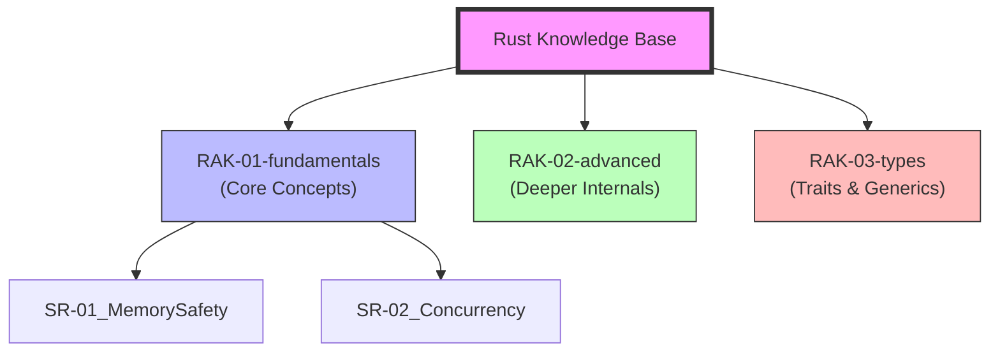

# Rust Knowledge Base

Rust Knowledge Base adalah sebuah perpustakaan digital interaktif yang dirancang untuk membongkar misteri, mekanisme internal, dan arsitektur inti dari bahasa Rust.

Repositori ini secara spesifik bertindak sebagai **"The Brain"** dalam *Master Plan: Polyglot Senior Architect*. Fokus materi di sini murni pada **Core Language Rust** (seperti *Ownership, Borrowing, Lifetimes, Memory Safety*), dan **bukan** tempat untuk membahas Framework UI (seperti Yew) atau Web Frameworks (seperti Axum) yang memiliki ekosistem sendiri.

## Struktur Perpustakaan (5-Level Hierarchy)

Sesuai standar **PPM (Perpustakaan Pribadi Modular)**, setiap materi mengikuti hierarki:
**Rak -> Sub-Rak -> Buku -> Bab -> Section.**

---

## Roadmap & Status Pengembangan

| Rak | Deskripsi | Status |
| :--- | :--- | :--- |
| `RAK-01-fundamentals/` | Ownership, Borrowing, Lifetimes | 1% | [/] In Progress |
| `RAK-02-advanced/` | Unsafe Rust, FFI, Macros | *Planned* |
| `RAK-03-types/` | Traits, Generics, Zero-cost abstractions | *Planned* |

## Visi & Tujuan

Repository ini bukan sekadar tempat menaruh *snippet* kode, melainkan sebuah laboratorium mental untuk memahami "The Soul of Rust".

---
*Dokumentasi Lengkap & Roadmap: [catatan](file:///i:/Workspace/Workspace-Syahputrawork/catatan/01-Language-Hubs/Rust-Knowledge-Base.md)*