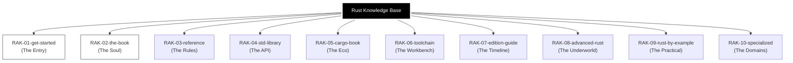

# Rust Knowledge Base

> **"Safety, Speed, and Systems: The Path to Rust Architecture."**

## Latar Belakang & Visi
Rust adalah bahasa masa depan untuk pengembangan sistem yang aman dan performan. Repositori ini membedah "Rust Bookshelf" secara terstruktur, dari kepemilikan memori (Ownership) hingga pemrograman tingkat rendah (Unsafe Rust).

## Struktur Perpustakaan (10-Rack Architecture)

## Roadmap & Status Pengembangan

| Rak | Deskripsi | Status |
| :--- | :--- | :--- |
| `RAK-01-get-started/` | Setup & Rustup | *Planned* |
| `RAK-02-the-book/` | Core Ownership Logic | *Planned* |
| `RAK-03-reference/` | Language Specification | *Planned* |
| `RAK-04-std-library/` | API Docs & Collections | *Planned* |
| `RAK-05-cargo-book/` | Dependency Management | *Planned* |
| `RAK-06-toolchain/` | rustc, rustdoc, clippy | *Planned* |
| `RAK-07-edition-guide/` | 2015 to 2024 Transition | *Planned* |
| `RAK-08-advanced-rust/` | Unsafe, Nomicon, Macros | *Planned* |
| `RAK-09-rust-by-example/` | Tutorial Snippets | *Planned* |
| `RAK-10-specialized/` | WASM, Embedded, CLI | *Planned* |

---
*Dokumentasi Lengkap: [docs/README.md](./docs/README.md)*