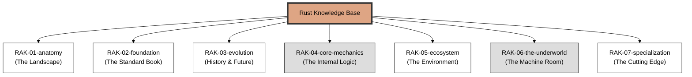

# Rust Knowledge Base

> **"Empowering Everyone to Build Reliable and Efficient Software."**

## 🏛️ Arsitektur 7-Rak (Universal Standard)
Repositori ini menggunakan **7-Rack Universal Architecture** dengan prinsip **Digital Mirroring** untuk memisahkan antara fondasi penggunaan dengan dekonstruksi arsitektur mesin.

---

## 🗄️ Struktur Perpustakaan

### 1. [RAK-01-anatomy](./RAK-01-anatomy/)
Filosofi desain memori aman tanpa GC, sejarah, dan batasan *The Triangle of Trade-offs*.

### 2. [RAK-02-foundation](./RAK-02-foundation/)
Sintaks dan tipe data dasar yang bersumber langsung dari *The Rust Programming Language*.

### 3. [RAK-03-evolution](./RAK-03-evolution/)
Evolusi Rust Editions (2015, 2018, 2021) dan target perkembangan kompilator masa depan.

### 4. [RAK-04-core-mechanics](./RAK-04-core-mechanics/)
Mekanika Paling Mendalam: *Ownership*, *Borrow Checking*, *Lifetimes*, dan *Traits*.

### 5. [RAK-05-ecosystem](./RAK-05-ecosystem/)
Ekosistem Rust: perbedaan `std` vs `core`, Cargo Toolchain, dan Crates.io.

### 6. [RAK-06-the-underworld](./RAK-06-the-underworld/)
Deep dive ke *Unsafe Rust*, *FFI*, *Raw Pointers*, dan *Memory Layout*.

### 7. [RAK-07-specialization](./RAK-07-specialization/)
Implementasi domain spesifik: *WebAssembly (Wasm)*, *Async Rust*, dan *Embedded*.

---

## 📏 Standar Kualitas (Gold Standard)
Setiap materi mengikuti prinsip **Digital Mirroring** dan standar **PPM V4**:
1. **Source-Synced**: Akurasi 1:1 terhadap dokumentasi resmi/spesifikasi.
2. **Experimental Lab**: Kode pembuktian fungsional di folder `examples/`.
3. **Mental Model Visual**: Diagram Mermaid inline di `README.md`.
4. **Narrative Excellence**: Penjelasan mendalam dengan analogi sistem.

*Dokumentasi Lengkap Standar: [docs/standards/architecture.md](./docs/standards/architecture.md)*

---
*Status Pengembangan: [status.md](./status.md)*