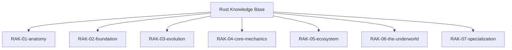

# Rust Knowledge Base

> **"Empowering Everyone to Build Reliable and Efficient Software."**

## Arsitektur 7 Rak

Repositori ini menggunakan arsitektur 7 rak untuk memisahkan fondasi penggunaan, reasoning model, toolchain, dan detail low-level Rust.

## Struktur Perpustakaan

### 1. [RAK-01-anatomy](./RAK-01-anatomy/)
Asal-usul Rust, filosofi desain, trade-off, dan konteks mengapa Rust hadir.

### 2. [RAK-02-foundation](./RAK-02-foundation/)
Fondasi penggunaan Rust sehari-hari: sintaks, tipe dasar, ownership dasar, module system, dan error handling.

### 3. [RAK-03-evolution](./RAK-03-evolution/)
Perkembangan edition, RFC, perubahan idiom, dan arah pertumbuhan Rust.

### 4. [RAK-04-core-mechanics](./RAK-04-core-mechanics/)
Reasoning model inti Rust: ownership lanjutan, borrowing, lifetimes, traits, generics, dan semantik yang membentuk bahasa.

### 5. [RAK-05-ecosystem](./RAK-05-ecosystem/)
Toolchain, standard library, Cargo, workspace, testing, documentation tooling, dan boundary antara bahasa dengan lingkungan kerja.

### 6. [RAK-06-the-underworld](./RAK-06-the-underworld/)
Unsafe Rust, FFI, memory layout, compiler pipeline, dan detail rendah yang berada di balik jaminan safety.

### 7. [RAK-07-specialization](./RAK-07-specialization/)
Domain khusus seperti async, embedded, WebAssembly, dan area penerapan Rust yang membutuhkan konteks tambahan.

## Standar Kualitas

Setiap materi di repo ini mengikuti quality bar yang sama:
1. **Source Link**: ada rujukan ke sumber primer yang relevan.
2. **Formal Definition + Analogy**: konsep dijelaskan dengan presisi dan tetap mudah dicerna.
3. **Visual Logic**: Mermaid inline dipakai bila visual memang membantu.
4. **Under-the-hood**: ada penjelasan mekanisme internal yang relevan.
5. **Practical Lab**: ada pembuktian kode bila topiknya memang membutuhkannya.
6. **Pitfalls**: ada jebakan, batasan, atau miskonsepsi yang diluruskan.

Dokumen inti repo:
- [docs/standards/README.md](./docs/standards/README.md)
- [docs/standards/authoring.md](./docs/standards/authoring.md)
- [docs/repository-plan/README.md](./docs/repository-plan/README.md)
- [status.md](./status.md)
