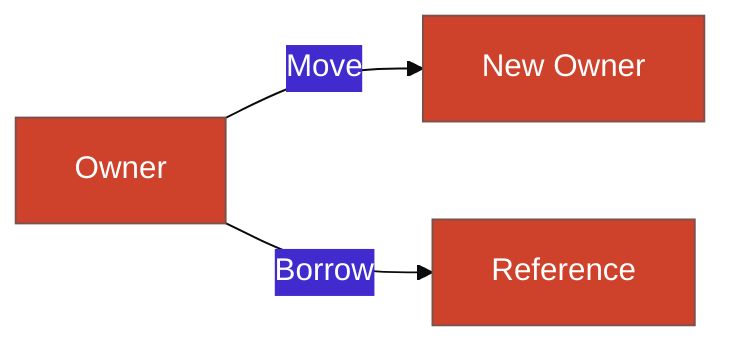

# Panduan Estetika Visual (Rust Edition)

Visualisasi harus terasa industrial, kokoh, dan teknis.

## 1. Skema Warna (Branding)
- **Primary Color**: `#CE412B` (Ferris Orange / Rust Red).
- **Secondary Color**: `#DEA584` (Soft Rust).
- **Accent**: `#252525` (Steel Gray).

## 2. Standar Mermaid
Diagram harus menunjukkan batasan dan alur yang jelas:

## 3. Simbol Visual
- **Roda Gigi/Gear**: Ikon ornamen untuk menunjukkan kekuatan sistem bawah tanah.
- **Warna Merah**: Menandakan batasan *Borrow Checker*.
- **Warna Hijau**: Menandakan akses memori yang aman.
