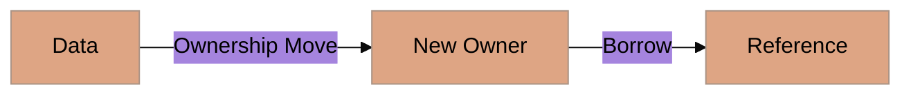

# Panduan Estetika Visual (Rust Edition)

Mencerminkan kekuatan, keamanan, dan presisi sistem.

## 1. Skema Warna (Branding)
- **Primary Color**: `#DEA584` (Rust Orange).
- **Secondary Color**: `#282C34` (Deep Charcoal / System Dark).
- **Action Color**: `#A72145` (Compiler Crimson - for errors/warnings).

## 2. Standar Mermaid
Diagram harus terlihat kokoh dan terstruktur:

## 3. Simbol Visual
- **Passport/Stamp**: Mewakili **Ownership**.
- **Warna Oranye**: Digunakan untuk elemen data yang valid dan aman.
- **Warna Merah/Crimson**: Digunakan untuk elemen **Unsafe** atau **Compile Error** lab.

---
*Referensi: [Architecture](./architecture.md)*
